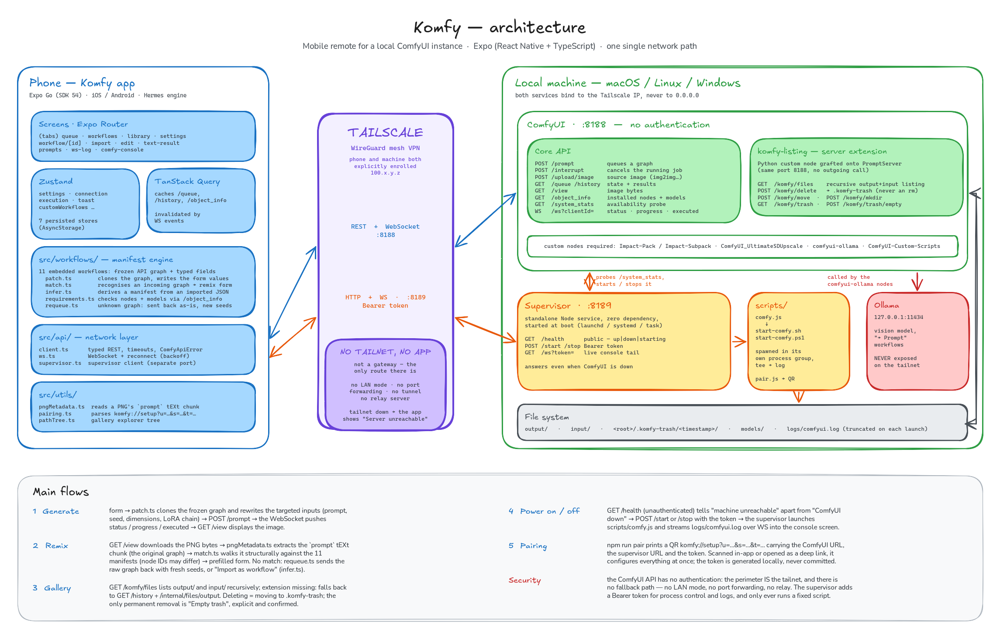

# Komfy

Mobile remote (iOS/Android) for a local ComfyUI instance: follow and control
the queue, launch embedded workflows (with LoRAs), browse the output
gallery, remix an image from its recipe. UI in English and French
(selector in Settings).

> Personal project: the embedded workflows are tailored to a specific
> setup (KREA2 models, Impact Pack detectors, local Ollama). The code —
> API client, graph patching, remix, gallery — is generic and reusable
> for other workflows.

Stack: Expo SDK 54 (React Native + TypeScript), Expo Router, Zustand,
TanStack Query, i18next. Network: **Tailscale only**. The types in
[`src/api/types.ts`](./src/api/types.ts) transcribe responses captured from a
real ComfyUI server (0.27.0) — none of them are guessed; the capture notes
themselves (`docs/api-notes.md`) are local working files, not published.

## Architecture

<picture>
  <source media="(prefers-color-scheme: dark)" srcset="./docs/architecture-dark.png">
  
</picture>

<sub>Editable source: [`docs/architecture.excalidraw`](./docs/architecture.excalidraw)
— drop it on [excalidraw.com](https://excalidraw.com) to edit, then re-export.</sub>

## Prerequisites

Server side:

- **ComfyUI** installed, with the models referenced by the manifests in
  `src/workflows/` (KREA2 Turbo checkpoint, Qwen VAE/CLIP, Ultralytics
  detectors, ESRGAN-family upscalers — see each workflow file);
- **Custom nodes**: [ComfyUI-Impact-Pack](https://github.com/ltdrdata/ComfyUI-Impact-Pack)
  and [Impact-Subpack](https://github.com/ltdrdata/ComfyUI-Impact-Subpack)
  (detection, DetailerForEach), [comfyui-ollama](https://github.com/stavsap/comfyui-ollama)
  and [ComfyUI-Custom-Scripts](https://github.com/pythongosssss/ComfyUI-Custom-Scripts)
  ("→ Prompt" workflows),
  [ComfyUI_UltimateSDUpscale](https://github.com/ssitu/ComfyUI_UltimateSDUpscale)
  (Upscale workflow);
- **Ollama** running locally (`127.0.0.1:11434`, never exposed on the
  tailnet) with a vision model tagged `gemma4-vision:latest` — only for the
  "→ Prompt" workflows. Any Gemma-class vision model works; alias yours
  with `ollama cp <your-model> gemma4-vision:latest`;
- **Tailscale** connected (see Security).

Development / phone side:

- **Node 20+** and npm;
- **Expo Go** (SDK 54 build) on the phone, **Tailscale** connected to the
  same tailnet as the server;
- an Expo account (free) only for EAS Update publishing.

## Server setup (once)

Works on any OS with a local ComfyUI install (macOS / Linux / Windows) —
nothing below assumes a Mac.

1. **Tailscale** installed and connected on the server and the phone (same
   tailnet). Server IP: `tailscale ip -4` → `100.x.y.z`.
2. **ComfyUI** launched listening on the Tailscale interface **only**
   (never `0.0.0.0`, never port forwarding or a public tunnel). The repo
   ships launch scripts that wrap the right command per OS:

   ```bash
   # macOS / Linux
   npm run comfy                 # or: bash scripts/start-comfy.sh
   ```
   ```powershell
   # Windows
   .\scripts\start-comfy.ps1
   ```

   Both read `COMFY_DIR`, `VENV_PY` and `BASE_DIR` from the environment (the
   defaults point at the maintainer's tree — override them for your install,
   e.g. `COMFY_DIR=/opt/ComfyUI VENV_PY=/opt/ComfyUI/.venv/bin/python3 …`).
   The canonical command they run is:

   ```bash
   <venv-python> main.py \
     --listen $(tailscale ip -4) --port 8188 \
     --preview-method auto \
     --bf16-text-enc \
     --base-directory <comfy-data-dir> \
     --user-directory <comfy-data-dir>/user_tailscale
   ```

   `--bf16-text-enc` is **required for the Image → Video (WAN 2.2) workflow**:
   its UMT5-XXL text encoder overflows in the default fp16 (black / NaN
   frames), and bf16 fixes it. It is safe for the image workflows — KREA2's
   Qwen3-VL encoder is fp8-scaled (weights stay fp8, bf16 only sets the
   compute dtype, which is Qwen's native dtype) and conditioning is
   accumulated in fp32, so their output is unaffected.

   **Per-OS notes:**

   - **macOS (Apple Silicon / MPS):** the script exports
     `PYTORCH_MPS_HIGH_WATERMARK_RATIO=0` and `PYTORCH_ENABLE_MPS_FALLBACK=1`
     — Metal-only tuning, gated behind a `uname = Darwin` check.
   - **Linux (NVIDIA / CUDA):** nothing extra to export, the default
     attention backend is fine; AMD uses ROCm, otherwise `--cpu`.
   - **Windows:** run the PowerShell twin `scripts/start-comfy.ps1`; the venv
     Python is `.venv\Scripts\python.exe`.
   - **`--extra-model-paths-config`** is optional (and was a macOS-only path
     in older setups): add it **only** if models live outside
     `<comfy-data-dir>/models`, otherwise they appear **duplicated** in the
     dropdowns. Config location: macOS
     `~/Library/Application Support/Comfy Desktop/…`, Windows
     `%APPDATA%\ComfyUI\…`, Linux `~/.config/ComfyUI/…`.

   (A `comfy-server` agent in `.claude/agents/` knows how to rediscover and
   relaunch this configuration on the maintainer's macOS setup.)

3. **Listing extension** (full gallery) — symlink then restart ComfyUI:

   ```bash
   # macOS / Linux
   ln -s "<repo>/server/komfy-listing" <comfy-data-dir>/custom_nodes/komfy-listing
   ```
   ```powershell
   # Windows (PowerShell, Developer Mode or admin)
   New-Item -ItemType SymbolicLink `
     -Path <comfy-data-dir>\custom_nodes\komfy-listing `
     -Target <repo>\server\komfy-listing
   ```

   Details: [server/komfy-listing/README.md](./server/komfy-listing/README.md).
   Without it, the gallery falls back to the current session's history.

4. **Remote power** (optional) — turn ComfyUI on/off from the phone and watch
   its console live. Install the supervisor as a boot service, then pair:

   ```bash
   # macOS / Linux / Windows — pick one:
   bash server/supervisor/install/install-macos.sh
   bash server/supervisor/install/install-linux.sh
   pwsh -File server\supervisor\install\install-windows.ps1

   npm run pair    # prints a QR to scan in the app (Settings ▸ Server power)
   ```

   The supervisor is a **dependency-free** Node service that listens on the
   Tailscale IP (port `8189`) and owns the ComfyUI process lifecycle — so it
   answers even when ComfyUI is down. It reuses `scripts/start-comfy.*` to
   launch, and streams `<BASE_DIR>/logs/comfyui.log` to the in-app console.
   Details: [server/supervisor/README.md](./server/supervisor/README.md).

## App setup (development)

```bash
npm install
npm start          # Metro announced on the Tailscale IP → works on Wi-Fi AND 4G/5G
```

On first launch a setup wizard asks for the server URL: **scan the pairing QR**
(`npm run pair`, fills the URL + supervisor token in one shot), paste the code,
or type it by hand (`http://<tailscale-ip>:8188` — a bare IP/host gets `:8188`
added). Editable later in Settings; persisted on the phone.

`npm start` announces Metro on the **Tailscale IP** (a single URL, at home
and on cellular — like the API). ⚠️ Known pitfalls:

- **always scan the QR code of the current session** — Expo Go's
  "Recently opened" history keeps old LAN URLs (`exp://192.168…`) that
  fail on mobile data (long-press to delete them);
- check that Expo Go is allowed to use cellular data
  (iOS Settings → Cellular);
- `npm run start:lan`: local-IP fallback when Tailscale is down.

EAS Update publishing (below) removes the question entirely: the bundle
then comes from Expo's CDN.

## Publishing without the server running (EAS Update + Expo Go)

The app is pure JS: no native build needed, Expo Go is enough.
Once published, it launches from Expo Go **without** a dev server.

First time (Expo account required, free):

```bash
npm i -g eas-cli
eas login
eas init                  # links the project (projectId in app.json)
eas update:configure      # adds updates.url + runtimeVersion
eas update --branch main --message "v1"
```

Then on the iPhone: open the URL printed by the command once (or
`exp://u.expo.dev/<projectId>?channel-name=main`) — it then stays in Expo
Go's history. On every change: `eas update --branch main`.

Moving later to a real installed app (Komfy icon, TestFlight): paid Apple
Developer account + `eas build --profile preview --platform ios` — no code
changes.

## Adding a workflow

**Without touching the code** (runtime import): Workflows tab → **Import**
card → paste an API-format JSON (Settings → Dev mode → "Save (API Format)");
the app infers the form fields (prompts, seeds, dimensions, model files,
LoRA chains become an editable LoRAs field) and validates the graph against
the connected server. Also offered from the gallery when an image's recipe
matches no known workflow ("Import as workflow"). Imported workflows are
persisted on the phone and remixable like the embedded ones. A long press
on their card opens Edit / Delete: the editor renames the workflow,
relabels/reorders/removes fields, adds fields from a graph inspector
(remaining literal inputs, typed automatically), adds a **LoRAs field** on
any detected model chain, and copies the manifest JSON — pasting that JSON
into Import on another phone transfers the workflow as-is.

**As code** (embedded, versioned in the repo):

1. In ComfyUI: Settings → Dev mode → **Save (API Format)**.
2. Create `src/workflows/<id>.ts`: paste the graph, write the manifest
   (name, icon, description, `saveNodeId`, patchable fields — see
   [krea2-text2img.ts](./src/workflows/krea2-text2img.ts) as a model).
   Field kinds: `text`, `number`, `seed`, `select`, `model`, `modelSource`,
   `dimensions`, `image`, `mask`, `loras`, `persons`. A `model` field offers
   the files actually installed on the server (its target's `/object_info`
   enum, optional family `filter` regex) instead of freezing a filename;
   `modelSource` generalizes it to a whole model (checkpoint, or diffusion
   model + CLIP + VAE). A `mask` field lets the user paint an area over the
   picture held by another field (`sourceKey`) and uploads it as a PNG.
   User-facing manifest strings are i18n keys — add them to
   [src/i18n/en.ts](./src/i18n/en.ts) and [fr.ts](./src/i18n/fr.ts).
3. Register it in [src/workflows/index.ts](./src/workflows/index.ts).
4. Check the `class_type`s and model filenames against the real server's
   `GET /object_info` (rule: never guess).

Bonus: an embedded workflow automatically becomes **remixable** — the
gallery's "Create a variant" button matches images generated with it
(even with different node IDs) and pre-fills the form. The Workflows
screen also checks every workflow against the connected server
(`/object_info/{NodeName}`): cards whose custom nodes or model files are
missing get a warning badge listing exactly what to install.

## Security

The ComfyUI API has **no authentication**: all security is network access
control, provided by Tailscale (WireGuard, explicitly enrolled devices).

- Bind to the Tailscale IP only — never `0.0.0.0`, never internet
  exposure (router, ngrok…).
- Tailnet restricted to the server + phone(s); optional: ACL on port 8188.
- No secret in the repo or the app; the server URL lives in AsyncStorage.
- The `komfy-listing` extension makes no outgoing calls. Deletion is soft
  (move to a per-root `.komfy-trash`); the only permanent removal is the
  explicit, confirmed "Empty trash" action in Settings.
- The **supervisor** (remote on/off) binds to the Tailscale IP only (port
  8189) and guards start/stop + the log stream with a bearer **token**
  generated on first run (`server/supervisor/.token`, git-ignored, delivered
  to the phone by the pairing QR — never committed). Its `/health` (up/down)
  is unauthenticated by design; it only ever runs the fixed `start-comfy.*`
  script, so there is no command-injection surface.
- Useful periodic check: port 8188 must be unreachable from a device
  outside the tailnet.

## Responsible use

Komfy is a remote control for **your own** ComfyUI instance: what gets
generated is entirely determined by the models and workflows you choose to
run. The embedded FaceSwap workflow edits faces in a source image; it is
intended for creative work on your own photos or with the **explicit
consent** of the people depicted. Do not use it to impersonate or deceive,
or to produce non-consensual or intimate imagery of real people — such use
is illegal in many jurisdictions and contrary to the intent of this
project.

## Structure

```
komfy/
├── src/app/              # screens (Expo Router): (tabs)/queue·workflows·library·settings, workflow/[id]·import·edit·text-result, prompts, ws-log, comfy-console
├── src/api/              # client.ts, supervisor.ts, ws.ts (WebSocket), types.ts, queryClient.ts
├── src/i18n/             # i18next setup + en/fr dictionaries (default: English)
├── src/workflows/        # manifests + frozen API graphs, patch.ts, match.ts (remix), requirements.ts (availability), infer.ts + registry.ts (runtime import)
├── src/components/       # UI (queue cards, pickers, viewer, SetupWizard, ServerPowerCard, PairingScanner…)
├── src/store/            # Zustand: settings, connection, supervisor, execution, toast, outputPrefs, customWorkflows, generatedPrompts (phone-local prompt library)
├── src/hooks/            # useQueue, useGallery, useLoras, useRemix, useHealthCheck, useSupervisor(+Logs), useAvailability, usePendingPrompts
├── src/utils/            # pathTree (explorer), pngMetadata (tEXt chunks), pairing (QR/deep-link setup code), maskRaster + png (JS mask rasterizer/PNG encoder)
├── src/theme/tokens.ts   # style guide — no hardcoded styles elsewhere
├── server/komfy-listing/ # ComfyUI extension (recursive output+input listing, trash)
├── server/supervisor/    # standalone Node service: remote ComfyUI on/off + live console
└── docs/architecture.*   # architecture diagram: Excalidraw source + PNG exports
                          # (rest of docs/ = local notes, git-ignored)
```
